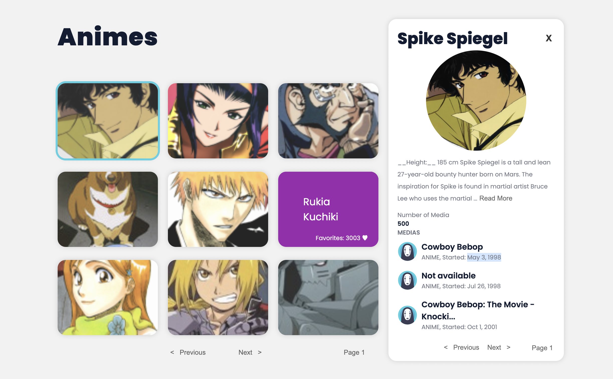

# Anime Gallery



## Functional specifications

This project has been made with the purpose of being part of my portfolio.


The user will be able to access to an anime's gallery and browse throug the pages.
It is also possible to access the details for a selected character by clicking over it.

### Front-end
In the project directory you can install the dependencies running 

```sh
$ npm install
```

Then you can start the project in development mode running

```sh
$ npm start
```

To lunch the test runner in the interactive watch mode can use the command

```sh
$ npm test
```

Want to see it live?

https://lighthearted-sprinkles-45cf0d.netlify.app/
